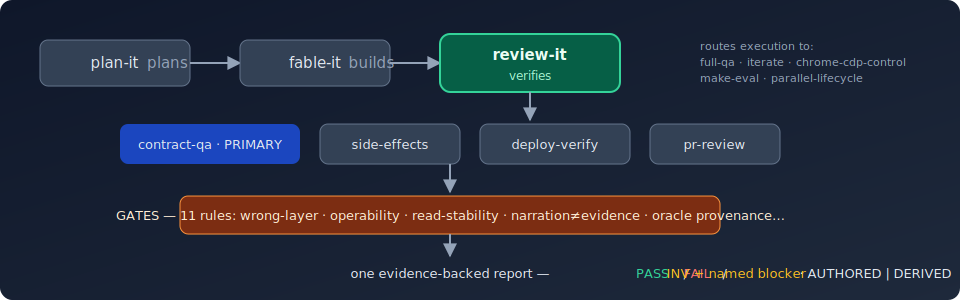

<div align="center">

<h1>/review-it</h1>

<h3>
  <strong>The QA front door — prove the build obeys the plan</strong>
</h3>

<p>
  plan-it plans. fable-it builds. <strong>review-it verifies.</strong><br>
  The independent verification leg of the plan → build → review triangle.
</p>



<p>
  <a href="#installation"></a>
  <a href="https://opensource.org/licenses/MIT"></a>
</p>

<p>
  <a href="#installation">Install</a>
  &nbsp;·&nbsp;
  <a href="#why">Why</a>
  &nbsp;·&nbsp;
  <a href="#how-it-works">How it works</a>
  &nbsp;·&nbsp;
  <a href="#the-gate-catalog">The gate catalog</a>
  &nbsp;·&nbsp;
  <a href="#whats-bundled">What's bundled</a>
  &nbsp;·&nbsp;
  <a href="CHANGELOG.md">Changelog</a>
</p>

</div>

## Why

Two real incidents define this plugin (the Airtable postmortem):

1. A run shipped **"VERIFIED" UI with 4 operability bugs** — the tests checked that a
   combobox *rendered text*, never that it could be typed into, opened, or used to
   select anything.
2. A third-party write whose **record rendered empty in Airtable's own UI** while every
   API GET looked correct — verified in the wrong layer.

Both were caught by a human, *after* the report said green. review-it makes those two
failures — and nine sibling classes — mechanically un-shippable, with a gate catalog
where every rule is written as **trigger → test → action** and every verdict is a lookup
into an evidence ledger, not a judgment call.

And the quiet failure underneath them all: a QA run with no authored test contract that
quietly reverse-engineers its expectations *from the code it is testing* — and then grades
itself green. review-it tags every verdict's oracle **AUTHORED** or **DERIVED**; a
DERIVED green means "self-consistent," never "obeys the plan." **No self-graded green.**

## Installation

```bash
# 1. Add the DevOtts marketplace (once — shared with fable-it / plan-it)
/plugin marketplace add DevOtts/review-it

# 2. Install
/plugin install review-it@devotts
```

Then hand it a target:

```
/review-it qa/test-plan-master.md      # contract-qa: run the plan-phase Test Contract
/review-it PR #42                      # pr-review: severity-tiered, evidence-cited
/review-it prod                        # deploy-verify: is it ACTUALLY live + ready?
/review-it <feature dir with third-party writes>   # side-effects verification
```

## How it works

```
/review-it <target>
   │
   ├─ MODE contract-qa    → PRIMARY: run the plan-phase Test Contract against the build
   ├─ MODE side-effects   → third-party writes read back from the target's OWN API + UI
   ├─ MODE deploy-verify  → deployed-code ladder + [REAL] re-runs + release checklist
   └─ MODE pr-review      → SECONDARY: severity-tiered findings, blocking vs advisory
   ▼
  GATES  — 11 rules, applied in every mode
   ▼
  REPORT — one format, shared with fable-it's evidence ledger
```

- **Preflight (R9)** — prove *which* app/branch/checkout is under test before any verdict.
- **Verifiability precheck** — unreachable target ⇒ honest `IMPLEMENTED-NOT-VERIFIED`
  with a named blocker, never a manufactured green. `[REAL]` cases are never verified on
  a mock.
- **No-contract ladder** — invoked with no Test Contract, it never refuses and never
  self-grades: locate an authored oracle (plan-it DoDs/goals count) → derive only if none
  → confirm → label provenance → persist the derived contract as durable coverage.
- **Routing, not re-implementation** — execution goes to the existing specialists by
  name: `full-qa` (functional/CDP QA), `iterate` (fix loops), `chrome-cdp-control`
  (authenticated real Chrome), `make-eval` (LLM evals), `parallel-lifecycle` (isolation).
- **The honesty layer** — every mode's verdict passes an evidence adapter (VERIFIED is a
  ledger lookup), a system-of-record adapter (subagent narration is never evidence), and
  a fresh-context verifier that reads the *pixels*, not just the prose.

## The gate catalog

| # | Gate | Kills |
|---|------|------|
| R1 | wrong-layer | third-party writes "verified" without reading the target's own API **and** UI |
| R2 | operability | "shows a value" passed off as "is operable" |
| R3 | read-stability | verdicts off a single read; false regressions off read-after-write lag |
| R4 | first-look | the human becoming the un-instrumented first tester |
| R5 | directive-lookup | credential/mechanism proposals that ignore standing rulings |
| R6 | narration≠evidence | subagent self-reports accepted without record-of-truth re-derivation |
| R7 | pixels-over-prose | reports whose screenshots contradict their claims |
| R8 | deploy-truth | MERGED / "Ready" / green-cached-build treated as deploy evidence |
| R9 | environment-identity | verdicts issued against the wrong app/branch/checkout |
| R10 | debrief-methodology | postmortems that log bugs but never the methodology hole |
| R11 | oracle-provenance | the self-grading trap — expectations derived from the code under test reported as "obeys the plan" |

Full specs (each trigger → test → action):
[`plugins/review-it/skills/references/gate-catalog.md`](plugins/review-it/skills/references/gate-catalog.md).

## What's bundled

| Piece | Path | Job |
|---|---|---|
| Front door | `plugins/review-it/skills/review-it/` | mode detection, preflight, oracle ladder, routing, report |
| side-effects | `plugins/review-it/skills/side-effects/` | third-party write verification (the Airtable class) |
| deploy-verify | `plugins/review-it/skills/deploy-verify/` | staging/prod: deployed-code ladder → READY / NOT-READY |
| pr-review | `plugins/review-it/skills/pr-review/` | severity-tiered review process, loads `.claude/review-config.md` |
| references | `plugins/review-it/skills/references/` | gate catalog · report format (shared with fable-it) · vocabularies · authoring standards · CI guidance |

## The family

| | [`plan-it`](https://github.com/DevOtts/plan-it) | [`fable-it`](https://github.com/DevOtts/fable-it) | `review-it` |
|---|---|---|---|
| Job | discovery → spec → agile split | goal + DoD → delivery | contract → verified verdicts |
| The bridge | authors the Test Contract | adopts it as its DoD | runs it against the build |

review-it consumes plan-it's Test Contract 1:1 and feeds its verdict rows into fable-it's
evidence ledger — one report format, hosted here, both plugins point at it.

## License

MIT — see [LICENSE](LICENSE).

---
_Authored by [DevOtts](https://github.com/DevOtts)._
